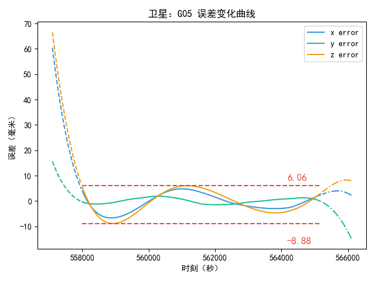
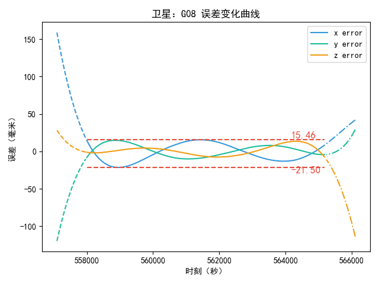

# GPS精密星历拟合广播星历

## 1. 介绍

此仓库为卫星大地测量课程的作业，主要实现了GPS精密星历拟合广播星历的算法。

## 2. 说明

### 2.1 依赖

- `Eigen3`，矩阵运算库
- `nlohmann/json`，json解析库

相关依赖均已包含在`third_party`文件夹中，无需额外安装。

### 2.2 编译

使用如下命令编译：

```bash
mkdir build
cd build
cmake ..
cmake --build .
```

### 2.3 运行

```bash
./ephemeris_fitting
```

### 2.4 程序中相关参数说明

下列参数需要在程序编译前进行配置（其实可以考虑用json文件配置）：

```c++
// sp3文件路径
string sp3_filepath = "E:/Sync/ephemeris_fitting/data/igs22296.sp3";

// 设置拟合的卫星PRN号
vector<string> prn_list = {"G01", "G02", "G03", "G04", "G05", "G06", "G07",
                           "G08", "G09", "G10", "G11", "G12", "G13", "G14",
                           "G15", "G16", "G17", "G18", "G19", "G20", "G21",
                           "G22", "G23", "G24", "G25", "G26", "G27", "G28",
                           "G29", "G30", "G31", "G32"};

// 建立输出文件夹
// 如果存在相同名称的文件夹，会删除原有文件夹
string output_folder = "result";

// 设置拟合星历参考时间
GNSSTime fit_time = GNSSTime(2022, 10, 1, 12, 0, 0, TIME_SYSTEM::GPST);

// 拟合相关设置（以下可以不修改）
FittingOptions options;
options.maxIter = 350;              // 最大迭代次数
options.tol = 1e-5;                 // 迭代收敛阈值，前后两次中误差的变化小于该值时
options.deltaF = -5;                // ΔF采用米级精度
options.delta = 1e-6;               // 计算toe时刻速度使用的微小量
options.fitKepler = true;           // 是否使用Kepler初轨作为初始值
options.fixDeltaOrbitParam = false; // 是否固定数值求导的微小量（在迭代中更新）
options.verbose = true;             // 输出迭代过程
```

### 2.5 使用`plot_error.py`绘制误差图

```bash
python plot_error.py -r <结果路径> -o <输出路径>
```

## 3. 效果

### 3.1 平差结果中误差

<p align="middle">
    
</p>

### 3.2 内插结果在X、Y、Z方向上的误差

<p align="middle">
    
</p>

<p align="middle">
    
</p>

<p align="middle">
    
</p>

### 3.3 拟合结果的内插精度和外推精度

<p align="middle">
    
    
</p>

<p align="middle">
    
    
</p>

<p align="middle">
    
    
</p>

<p align="middle">
    
    
</p>

<p align="middle">
    
    
</p>

<p align="middle">
    
    
</p>

<p align="middle">
    
    
</p>

<p align="middle">
    
    
</p>

<p align="middle">
    
    
</p>

<p align="middle">
    
    
</p>

<p align="middle">
    
    
</p>

<p align="middle">
    
    
</p>

<p align="middle">
    
    
</p>

<p align="middle">
    
    
</p>

<p align="middle">
    
    
</p>

<p align="middle">
    
    
</p>